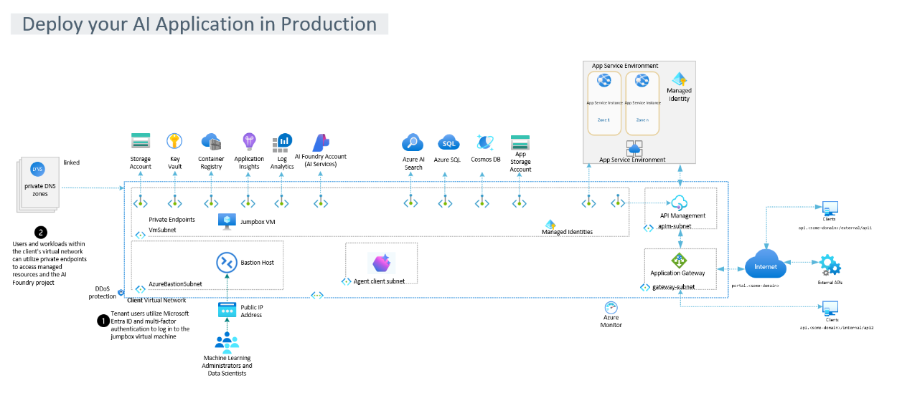

# Terraform Azure AI Foundry

This project deploys a secure, extensible, and integrated environment for running AI Foundry workloads in production on Azure. The infrastructure is defined using Terraform and organized into reusable modules for better maintainability and scalability.

## Introduction

Deploying AI models from development to production can be a complex process. This Terraform project aims to simplify that by providing a robust, scalable, and maintainable infrastructure for your AI applications on Azure, adhering to Microsoft Well-Architected Framework (WAF) recommendations.

## Architecture Diagram



## Architecture Overview

The provided architecture diagram illustrates a comprehensive and secure environment for deploying AI applications in production on Azure. The core components and their interactions are designed to ensure high availability, scalability, and robust security.

### Key Components:

-   **Client Virtual Network (VNet):** This is the central private network space in Azure, hosting the majority of the application's resources. It's protected by **DDoS protection** to safeguard against volumetric and protocol attacks.

    -   **VmSubnet:** A dedicated subnet within the VNet for hosting virtual machines, including a **Jumpbox VM**. The Jumpbox VM serves as a secure, hardened access point for administrators and data scientists to manage resources within the private network. Access to the Jumpbox VM is secured using **Microsoft Entra ID and multi-factor authentication**.
    -   **AzureBastionSubnet:** A specialized subnet for **Azure Bastion**, which provides secure and seamless RDP/SSH connectivity to VMs directly from the Azure portal over SSL, eliminating the need for public IP addresses on the VMs.
    -   **Agent Client Subnet:** A subnet designated for agent or client applications that need to interact with the AI services.
    -   **Private Endpoints:** All Azure platform services (PaaS) are integrated into the VNet using Private Endpoints. This ensures that traffic to these services traverses the Azure backbone network privately, enhancing security and reducing exposure to the public internet. Services connected via private endpoints include:
        -   **Storage Account:** For persistent data storage.
        -   **Key Vault:** Securely manages secrets, keys, and certificates.
        -   **Container Registry (ACR):** Stores and manages Docker container images.
        -   **Application Insights & Log Analytics:** For application performance monitoring and centralized logging.
        -   **AI Foundry Account (AI Services):** The core AI platform services.
        -   **Azure AI Search:** Provides search capabilities for the AI application.
        -   **Azure SQL & Cosmos DB:** Relational and NoSQL database services.
        -   **App Storage Account:** Additional storage for application data.

-   **App Service Environment (ASE):** A fully isolated and dedicated environment for running web applications at high scale. It can host multiple **App Service Instances** (Zone 1 to Zone n) for the AI application's front-end or API layer. **Managed Identities** are utilized by the App Service Environment for secure authentication to other Azure services.

-   **API Management (APIM):** Deployed within its own `apim-subnet`, APIM acts as a facade for the backend AI APIs, enabling secure, scalable, and managed access for clients. It handles API publishing, versioning, security policies, and analytics.

-   **Application Gateway:** Residing in a `gateway-subnet`, the Application Gateway is a web traffic load balancer that enables you to manage traffic to your web applications. It provides features like SSL termination, cookie-based session affinity, and web application firewall (WAF) capabilities.

-   **Internet & Clients:** External clients access the application securely through the Application Gateway and API Management, which are exposed to the internet. The diagram also shows integration with **External APIs**.

-   **Azure Monitor:** Provides comprehensive monitoring of the entire Azure infrastructure, collecting metrics, logs, and traces for analysis and alerting.

### Data Flow and Security:

-   Users and workloads within the client's virtual network can utilize private endpoints to access managed resources and the AI Foundry project securely.
-   Tenant users log in to the Jumpbox VM using Microsoft Entra ID and multi-factor authentication for secure management access.
-   All internal communication between services leverages private endpoints and the VNet, minimizing public exposure.
-   External access is controlled and secured via Application Gateway and API Management.

## Conceptual Agentic AI Solution: Azure Data & Solution Analyst Agent

**Important Note:** This Terraform project provisions the *Azure infrastructure* required to host an Agentic AI Solution. It does **not** deploy the application code for the agents themselves. The following section describes the conceptual application that *would run on* this provisioned infrastructure.

This infrastructure is designed to host a sophisticated Agentic AI Solution, conceptualized as an "Azure Data & Solution Analyst Agent." This intelligent system is capable of ingesting, analyzing, and providing actionable solutions based on diverse data inputs.

### Primary Goal:

To ingest data from various sources, analyze it to identify patterns, anomalies, or opportunities, and then propose concrete solutions or recommendations.

### Core Capabilities:

1.  **Data Ingestion & Storage:** Connect to various data sources (e.g., databases, storage accounts, external APIs) and store relevant data.
2.  **Data Processing & Feature Engineering:** Clean, transform, and prepare data for analysis.
3.  **Analysis & Pattern Recognition:** Apply AI/ML models (e.g., anomaly detection, predictive modeling, clustering) to extract insights.
4.  **Solution Generation:** Based on analysis, formulate actionable solutions or recommendations. This could involve leveraging Large Language Models (LLMs) for natural language generation of reports or action plans.
5.  **User Interaction:** Provide a way for users to submit data, query analyses, and receive solutions.

### How it Works (Conceptual Flow):

1.  **User Interaction (Clients):**
    *   Users interact with the system via a secure interface (web portal, chat, or API calls).
    *   **Application Gateway** provides WAF protection and load balancing as the entry point.
    *   **API Management (APIM)** routes and manages requests to core agent services, handling authentication and rate limiting.

2.  **Orchestration and Task Management (Orchestrator Agent):**
    *   A central **Orchestrator Agent** (deployed as a containerized application in the **Azure Container Apps Environment** or an **App Service in ASE**) receives user requests.
    *   It interprets user intent, breaks down tasks, and coordinates specialized sub-agents, managing the overall workflow and state.

3.  **Data Ingestion (Data Ingestion Agent):**
    *   Triggered by the Orchestrator, this agent (e.g., an **Azure Function** or another containerized app) connects to data sources like **Azure SQL**, **Cosmos DB**, or **Azure Storage Account**.
    *   It securely retrieves and stores raw data, utilizing **Azure Key Vault** for credentials.

4.  **Data Processing & Feature Engineering (Data Processing Agent):**
    *   Activated after ingestion, this agent (containerized app or Azure Function) cleans, transforms, and prepares raw data.
    *   Processed data is stored in **Azure SQL**, **Cosmos DB**, or **Azure Storage Account**.

5.  **Analysis & Pattern Recognition (Analysis Agent):**
    *   This agent (containerized application, potentially with specialized ML models) applies analytical techniques to processed data.
    *   It leverages **Azure OpenAI Service** for advanced NLP or to interpret complex data patterns and generate preliminary insights.

6.  **Solution Generation (Solution Generation Agent):**
    *   Receives insights from the Analysis Agent and formulates actionable solutions.
    *   Heavily utilizes **Azure OpenAI Service (LLM)** to generate human-readable reports, action plans, or code snippets.
    *   Can query **Azure AI Search** for relevant internal knowledge to inform recommendations (Retrieval Augmented Generation - RAG).

7.  **Communication and Feedback (Azure Service Bus):**
    *   **Azure Service Bus** (queues and topics) facilitates asynchronous, decoupled communication between agents, ensuring system responsiveness.

8.  **Monitoring and Management:**
    *   **Azure Log Analytics** and **Application Insights** continuously collect telemetry from all components.
    *   **Azure Monitor** provides a unified view for health, performance, and cost.
    *   **Jumpbox VM** and **Bastion Host** offer secure administrative access.

### Leveraging the Provisioned Azure Infrastructure:

This Agentic AI Solution is designed to seamlessly integrate with the Terraform-provisioned Azure infrastructure:

-   **Resource Group:** All application components and their supporting services are logically grouped within the provisioned resource group.
-   **Virtual Network (VNet) & Subnets:** Provides the secure and isolated network foundation for all agent communication and data access.
-   **Azure Key Vault:** Used by agents to securely retrieve credentials and secrets for accessing other Azure services.
-   **Azure Container Registry (ACR):** Stores Docker images for all containerized agent components, enabling efficient deployment and scaling.
-   **Azure OpenAI Service:** Directly consumed by the Analysis and Solution Generation Agents for advanced AI capabilities.
-   **Azure AI Search:** Utilized by the Solution Generation Agent for RAG capabilities.
-   **Azure SQL / Cosmos DB / Storage Account:** Serve as persistent storage layers for raw data, processed data, agent state, and analysis results.
-   **Log Analytics & Application Insights:** Provide comprehensive observability for the entire agent system.
-   **App Service Environment / Azure Container Apps Environment:** Provide scalable and isolated hosting environments for the various agent microservices and the UI/API layer.
-   **API Management / Application Gateway:** Securely expose the agent's API endpoints and user interfaces to external clients.
-   **Azure Service Bus:** Acts as the backbone for asynchronous messaging and event-driven interactions between the different agents.
-   **Managed Identities:** Agents will use the provisioned User Assigned Managed Identities for secure, credential-less authentication to other Azure services.

## Modular Structure

The Terraform code is organized into the following modules, each responsible for a specific set of resources:

-   **`resource_group`**:
    -   **Purpose:** Creates and manages the Azure Resource Group where all other resources will reside.
    -   **Resources:** `azurerm_resource_group`
    -   **Inputs:** `resource_group_name`, `location`
    -   **Outputs:** `name`, `location`, `id`

-   **`network`**:
    -   **Purpose:** Deploys the core networking components, including the Virtual Network and dedicated subnets (`VmSubnet`, `AzureBastionSubnet`, `Agent client subnet`). It also configures DDoS Protection for the VNet.
    -   **Resources:** `azurerm_virtual_network`, `azurerm_subnet`, `azurerm_network_ddos_protection_plan`
    -   **Inputs:** `vnet_name`, `address_space`, `location`, `resource_group_name`, `vm_subnet_name`, `vm_subnet_address_prefixes`, `bastion_subnet_name`, `bastion_subnet_address_prefixes`, `agent_client_subnet_name`, `agent_client_subnet_address_prefixes`, `enable_ddos_protection`, `ddos_protection_plan_name`
    -   **Outputs:** `vnet_id`, `vnet_name`, `vm_subnet_id`, `vm_subnet_name`, `bastion_subnet_id`, `bastion_subnet_name`, `agent_client_subnet_id`, `agent_client_subnet_name`, `ddos_protection_plan_id`

-   **`key_vault`**:
    -   **Purpose:** Provisions an Azure Key Vault and configures its private endpoint for secure access within the VNet.
    -   **Resources:** `azurerm_key_vault`, `azurerm_private_dns_zone`, `azurerm_private_dns_zone_virtual_network_link`, `azurerm_private_endpoint`
    -   **Inputs:** `kv_name`, `location`, `resource_group_name`, `tenant_id`, `vnet_id`, `subnet_id`
    -   **Outputs:** `id`, `name`

-   **`container_registry`**:
    -   **Purpose:** Sets up an Azure Container Registry and integrates it with the VNet via a private endpoint.
    -   **Resources:** `azurerm_container_registry`, `azurerm_private_dns_zone`, `azurerm_private_dns_zone_virtual_network_link`, `azurerm_private_endpoint`
    -   **Inputs:** `acr_name`, `location`, `resource_group_name`, `vnet_id`, `subnet_id`
    -   **Outputs:** `id`, `name`, `login_server`

-   **`openai`**:
    -   **Purpose:** Deploys an Azure OpenAI Service instance with private endpoint connectivity.
    -   **Resources:** `azurerm_cognitive_account`, `azurerm_private_dns_zone`, `azurerm_private_dns_zone_virtual_network_link`, `azurerm_private_endpoint`
    -   **Inputs:** `openai_name`, `location`, `resource_group_name`, `vnet_id`, `subnet_id`
    -   **Outputs:** `id`, `name`, `endpoint`

-   **`search`**:
    -   **Purpose:** Creates an Azure AI Search service and configures its private endpoint.
    -   **Resources:** `azurerm_search_service`, `azurerm_private_dns_zone`, `azurerm_private_dns_zone_virtual_network_link`, `azurerm_private_endpoint`
    -   **Inputs:** `search_name`, `location`, `resource_group_name`, `vnet_id`, `subnet_id`
    -   **Outputs:** `id`, `name`

-   **`log_analytics`**:
    -   **Purpose:** Provisions an Azure Log Analytics Workspace and an associated Application Insights instance for monitoring and logging.
    -   **Resources:** `azurerm_log_analytics_workspace`, `azurerm_application_insights`
    -   **Inputs:** `la_name`, `ai_name`, `location`, `resource_group_name`
    -   **Outputs:** `la_id`, `la_name`, `ai_id`, `ai_name`, `ai_instrumentation_key`

-   **`storage_account`**:
    -   **Purpose:** Deploys a general-purpose Azure Storage Account with private endpoint connectivity.
    -   **Resources:** `azurerm_storage_account`, `azurerm_private_dns_zone`, `azurerm_private_dns_zone_virtual_network_link`, `azurerm_private_endpoint`
    -   **Inputs:** `storage_account_name`, `resource_group_name`, `location`, `subnet_id`, `vnet_id`
    -   **Outputs:** `id`, `name`

-   **`azure_sql`**:
    -   **Purpose:** Provisions an Azure SQL Server and Database with private endpoint connectivity.
    -   **Resources:** `azurerm_mssql_server`, `azurerm_mssql_database`, `azurerm_private_dns_zone`, `azurerm_private_dns_zone_virtual_network_link`, `azurerm_private_endpoint`
    -   **Inputs:** `sql_server_name`, `sql_database_name`, `resource_group_name`, `location`, `sql_admin_login`, `sql_admin_password`, `subnet_id`, `vnet_id`
    -   **Outputs:** `sql_server_id`, `sql_server_name`, `sql_database_id`, `sql_database_name`

-   **`cosmos_db`**:
    -   **Purpose:** Deploys an Azure Cosmos DB account with private endpoint connectivity.
    -   **Resources:** `azurerm_cosmosdb_account`, `azurerm_private_dns_zone`, `azurerm_private_dns_zone_virtual_network_link`, `azurerm_private_endpoint`
    -   **Inputs:** `cosmosdb_account_name`, `resource_group_name`, `location`, `subnet_id`, `vnet_id`
    -   **Outputs:** `id`, `name`

-   **`app_storage_account`**:
    -   **Purpose:** Deploys an Azure Storage Account specifically for application data, with private endpoint connectivity.
    -   **Resources:** `azurerm_storage_account`, `azurerm_private_dns_zone`, `azurerm_private_dns_zone_virtual_network_link`, `azurerm_private_endpoint`
    -   **Inputs:** `app_storage_account_name`, `resource_group_name`, `location`, `subnet_id`, `vnet_id`
    -   **Outputs:** `id`, `name`

-   **`app_service_environment`**:
    -   **Purpose:** Provisions an Azure App Service Environment v3 for isolated and scalable web application hosting.
    -   **Resources:** `azurerm_app_service_environment_v3`
    -   **Inputs:** `ase_name`, `resource_group_name`, `subnet_id`
    -   **Outputs:** `id`, `name`

-   **`api_management`**:
    -   **Purpose:** Deploys an Azure API Management service for publishing, securing, and managing APIs.
    -   **Resources:** `azurerm_api_management`
    -   **Inputs:** `apim_name`, `location`, `resource_group_name`, `publisher_name`, `publisher_email`, `subnet_id`
    -   **Outputs:** `id`, `name`, `gateway_url`

-   **`application_gateway`**:
    -   **Purpose:** Creates an Azure Application Gateway with WAF capabilities for secure web traffic load balancing.
    -   **Resources:** `azurerm_public_ip`, `azurerm_application_gateway`
    -   **Inputs:** `ag_name`, `resource_group_name`, `location`, `subnet_id`
    -   **Outputs:** `id`, `name`, `public_ip_address`

-   **`jumpbox_vm`**:
    -   **Purpose:** Deploys a Linux Virtual Machine to serve as a secure jumpbox for administrative access.
    -   **Resources:** `azurerm_network_interface`, `azurerm_linux_virtual_machine`
    -   **Inputs:** `vm_name`, `resource_group_name`, `location`, `subnet_id`, `admin_username`, `admin_password`
    -   **Outputs:** `id`, `name`, `private_ip_address`

-   **`bastion_host`**:
    -   **Purpose:** Provisions an Azure Bastion Host for secure RDP/SSH connectivity to virtual machines.
    -   **Resources:** `azurerm_public_ip`, `azurerm_bastion_host`
    -   **Inputs:** `bastion_host_name`, `resource_group_name`, `location`, `subnet_id`
    -   **Outputs:** `id`, `name`

-   **`container_apps_environment`**:
    -   **Purpose:** Deploys an Azure Container Apps Environment to host containerized microservices and serverless applications.
    -   **Resources:** `azurerm_container_app_environment`
    -   **Inputs:** `ca_env_name`, `location`, `resource_group_name`, `log_analytics_workspace_id`
    -   **Outputs:** `id`, `name`

-   **`service_bus`**:
    -   **Purpose:** Provisions an Azure Service Bus Namespace and Queue for reliable messaging and inter-agent communication.
    -   **Resources:** `azurerm_servicebus_namespace`, `azurerm_servicebus_queue`, `azurerm_private_dns_zone`, `azurerm_private_dns_zone_virtual_network_link`, `azurerm_private_endpoint`
    -   **Inputs:** `sb_namespace_name`, `sb_queue_name`, `resource_group_name`, `location`, `subnet_id`, `vnet_id`
    -   **Outputs:** `namespace_id`, `namespace_name`, `queue_id`, `queue_name`

-   **`managed_identity`**:
    -   **Purpose:** Creates a User Assigned Managed Identity for secure, credential-less authentication of Azure resources.
    -   **Resources:** `azurerm_user_assigned_identity`
    -   **Inputs:** `identity_name`, `resource_group_name`, `location`
    -   **Outputs:** `id`, `name`, `principal_id`

## Getting Started

### Prerequisites

Before you begin, ensure you have the following installed:

-   [Terraform](https://www.terraform.io/downloads.html)
-   [Azure CLI](https://docs.microsoft.com/en-us/cli/azure/install-azure-cli)
-   An Azure subscription with Contributor permissions.

### Installation

1.  **Clone this repository:**
    ```bash
    git clone <repository_url>
    cd terraform-azure-ai-foundry
    ```

2.  **Log in to Azure:**
    ```bash
    az login
    ```

3.  **Initialize Terraform:**
    ```bash
    terraform init
    ```

4.  **Provide Sensitive Variables:**
    For sensitive variables like `sql_admin_password` and `vm_admin_password`, you **must** provide values. It is highly recommended to provide them via environment variables or a `.tfvars` file, rather than directly on the command line.

    **Using Environment Variables (recommended for CI/CD):**
    ```bash
    export TF_VAR_sql_admin_password="YourStrongSQLPassword!"
    export TF_VAR_vm_admin_password="YourStrongVMPassword!"
    ```

    **Using a `.tfvars` file (e.g., `terraform.tfvars`):**
    Create a file named `terraform.tfvars` in the root of your project with the following content:
    ```terraform
    sql_admin_password = "YourStrongSQLPassword!"
    vm_admin_password  = "YourStrongVMPassword!"
    ```
    *Note: Ensure this file is not committed to version control if it contains sensitive information.*

    **Generating Strong Passwords:**
    You can use tools like `openssl` or online password generators to create strong, random passwords:
    ```bash
    openssl rand -base64 12
    ```

5.  **Review the plan:**
    ```bash
    terraform plan
    ```

6.  **Apply the changes:**
    ```bash
    terraform apply
    ```

## Post-Deployment Testing

After successfully running `terraform apply`, it is crucial to perform a series of tests to validate the infrastructure. These tests cover various aspects to ensure everything is provisioned correctly and securely.

### 1. Basic Resource Verification (Azure Portal/CLI):

-   **Resource Group:** Verify that the main resource group exists and contains all expected resources.
-   **Virtual Network & Subnets:**
    -   Confirm the VNet exists with the correct address space.
    -   Verify that `VmSubnet`, `AzureBastionSubnet`, and `AgentClientSubnet` exist with their respective address prefixes.
    -   Check that private endpoint network policies are enabled on relevant subnets if configured.
-   **Azure Services:** For each deployed service (Key Vault, Container Registry, OpenAI, AI Search, SQL Server, Cosmos DB, Storage Accounts, Log Analytics Workspace, Application Insights, Container Apps Environment, Service Bus Namespace, Managed Identity, Application Gateway, Jumpbox VM, Bastion Host):
    -   Verify its existence in the Azure Portal.
    -   Check its basic configuration (e.g., SKU, location, name).

### 2. Network Connectivity & Isolation Tests:

-   **Private Endpoints:**
    -   For each service with a private endpoint (Key Vault, ACR, OpenAI, AI Search, SQL, Cosmos DB, Storage Accounts, Service Bus), attempt to access it from *within* the `VmSubnet` (e.g., from the Jumpbox VM) using its private IP or private DNS name. This should succeed.
    -   Attempt to access these services from *outside* the VNet (e.g., from your local machine without VPN/Bastion) using their public endpoints. This should **fail** if `public_network_access_enabled` is set to `false` (as it is for OpenAI).
    -   Verify that the corresponding Private DNS Zones are correctly linked to the VNet and contain the necessary A records for the private endpoints.
-   **Jumpbox VM Access:**
    -   Use Azure Bastion to securely connect to the Jumpbox VM (RDP/SSH). Verify that you can access resources within the VNet from the Jumpbox.
    -   Attempt to directly RDP/SSH to the Jumpbox VM's private IP from outside the VNet (should fail).
-   **Application Gateway:**
    -   Access the public IP or DNS name of the Application Gateway from your local machine. Verify that it responds (e.g., a default backend page or an error if no application is deployed yet).
    -   If configured, test WAF rules by attempting to trigger a common web attack (e.g., SQL injection payload in a URL parameter) and verify it's blocked.

### 3. Security Configuration Tests:

-   **Key Vault:**
    -   Verify that the Key Vault has RBAC enabled.
    -   Attempt to access secrets from the Jumpbox VM using a Managed Identity (if configured for the VM) or a service principal.
-   **Managed Identities:**
    -   Verify that the User Assigned Managed Identity exists.
    -   If you deploy an application (e.g., a Container App) and assign this Managed Identity to it, verify that the application can access other Azure services (e.g., Key Vault secrets, Storage Account) using this identity.
-   **DDoS Protection:** Confirm that the DDoS Protection Plan is associated with the VNet.
-   **Role-Based Access Control (RBAC):** Review the access policies on critical resources (e.g., Key Vault, databases) to ensure only authorized identities have the necessary permissions.

### 4. Monitoring & Logging Tests:

-   **Log Analytics Workspace & Application Insights:**
    -   Generate some activity on the deployed services (e.g., access Key Vault, make a request through APIM).
    -   Navigate to the Log Analytics Workspace and Application Insights in the Azure Portal.
    -   Verify that logs and metrics are being collected from the deployed resources.
    -   Run some basic Kusto queries to check for data presence.

### 5. Service-Specific Tests:

-   **Container Registry:** Log in to ACR from a Docker client (e.g., from the Jumpbox VM) and verify you can push/pull images.
-   **Azure SQL:** Connect to the SQL Server from the Jumpbox VM (using the private endpoint) and verify you can access the database.
-   **Cosmos DB:** Connect to the Cosmos DB account from the Jumpbox VM (using the private endpoint) and verify you can interact with it.
-   **Azure OpenAI:** From a client within the VNet (e.g., Jumpbox VM), attempt to make a call to the OpenAI endpoint.
-   **Azure AI Search:** From a client within the VNet, attempt to query the AI Search service.
-   **Azure Service Bus:** Send a message to the queue from one client and receive it from another (e.g., using simple console apps on the Jumpbox VM).

### Tools for Testing:

-   **Azure Portal:** For visual verification of resources and basic configurations.
-   **Azure CLI / Azure PowerShell:** For programmatic verification and executing commands (e.g., `az network vnet show`, `az keyvault secret show`).
-   **Jumpbox VM / Azure Bastion:** Your primary secure access point for internal network testing.
-   **`nslookup` / `dig`:** To verify private DNS resolution from within the VNet.
-   **`curl` / `wget`:** To test HTTP/HTTPS connectivity to endpoints.
-   **Terraform State:** While not a testing tool, `terraform state show` or `terraform output` can help retrieve resource IDs and names for testing.

## Network Topology and Security

The network architecture is designed for maximum security and isolation:

-   **Client Virtual Network:** The foundation of the secure environment, providing a private IP space.
-   **Subnets:** Dedicated subnets for different functionalities (VMs, Bastion, Agent clients) ensure logical segmentation.
-   **Private Endpoints:** All Azure PaaS services are accessed exclusively through private endpoints, eliminating public internet exposure for data traffic.
-   **Private DNS Zones:** Integrated with private endpoints to ensure proper name resolution within the VNet.
-   **Azure Bastion:** Provides secure, RDP/SSH access to VMs without exposing them to the public internet.
-   **DDoS Protection:** Enabled on the VNet to protect against network-layer attacks.
-   **Application Gateway & API Management:** Act as secure entry points for external traffic, providing load balancing, WAF capabilities, and API governance.

## Deployment Strategies (Terraform on Azure)

This project focuses on deploying the foundational Azure infrastructure for AI applications using Terraform. Once the infrastructure is provisioned, you can integrate your AI application using various deployment methods, such as:

-   **Azure Kubernetes Service (AKS):** For containerized AI applications requiring orchestration and scaling.
-   **Azure Container Instances (ACI):** For running isolated containers without managing underlying infrastructure.
-   **Azure Container Apps:** For hosting containerized microservices and serverless applications, ideal for agent components.
-   **Azure Machine Learning:** For end-to-end machine learning lifecycle management, including model deployment.

## Monitoring and Logging

The deployed infrastructure includes Azure Log Analytics Workspace and Application Insights to provide comprehensive monitoring and logging capabilities for your AI applications. You can use these services to:

-   Collect and analyze logs from all Azure resources.
-   Monitor application performance and identify bottlenecks.
-   Set up alerts for critical events.
-   Visualize data with dashboards.

## Security Best Practices

This Terraform project incorporates several security best practices:

-   **Network Isolation:** All services are configured with private endpoints, ensuring traffic remains within your Azure VNet and is not exposed to the public internet.
-   **Key Management:** Azure Key Vault is used to securely store sensitive information.
-   **Role-Based Access Control (RBAC):** Azure RBAC is recommended for managing access to resources.
-   **Managed Identities:** Utilize Managed Identities for Azure resources to authenticate to services without managing credentials.
-   **Secure Access to VMs:** Jumpbox VMs and Azure Bastion provide secure and controlled access to virtual machines.
-   **DDoS Protection:** Protects the virtual network from distributed denial-of-service attacks.

## Contributing

We welcome contributions! If you have suggestions for improvements or new features, please open an issue or submit a pull request.

## Future Enhancements and Considerations

-   **Managed Identities for App Service Environment:** Implement user-assigned managed identities for applications deployed within the App Service Environment for secure service-to-service authentication.
-   **App Service Plans and Web Apps:** Configure specific App Service Plans and deploy Web Apps or API Apps within the App Service Environment to host your AI application components.
-   **API Management Configuration:** Define specific APIs, operations, and policies within the API Management service to expose your AI application's endpoints.
-   **Database Schemas and Data:** Implement Terraform resources to manage SQL Database schemas, Cosmos DB containers, and initial data seeding.
-   **Storage Account Containers/Blobs:** Define specific storage containers and blob configurations for different data storage needs.
-   **CI/CD Pipelines:** Integrate Terraform deployment into a robust CI/CD pipeline (e.g., Azure DevOps, GitHub Actions) for automated infrastructure provisioning and updates.
-   **Advanced Monitoring and Alerting:** Configure more granular Azure Monitor alerts, dashboards, and workbooks for proactive issue detection and resolution.
-   **Cost Management:** Implement cost management best practices, including tagging, budget alerts, and rightsizing recommendations.
-   **Disaster Recovery and Business Continuity:** Plan and implement strategies for disaster recovery, including backup and restore procedures for databases and storage accounts.
